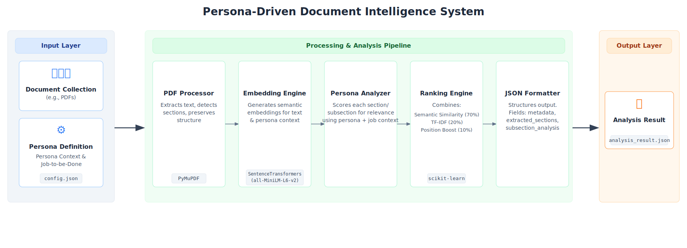

# Persona-Driven Document Intelligence System

## Overview

The **Persona-Driven Document Intelligence System** intelligently analyzes collections of diverse PDF documents and extracts the most relevant information **tailored to a specified user persona and their job-to-be-done**.

> **Core Objective:**  
> Connect _“what matters for the user who matters”_ by providing highly focused, prioritized content that aligns with the persona’s expertise and task requirements.

This is achieved through a **modular, scalable architecture** combining:
- Advanced text extraction
- Semantic embeddings
- Hybrid ranking

---

## System Architecture

The system is composed of five main components arranged in a pipeline:

1. **PDF Processor**
2. **Embedding Engine**
3. **Persona Analyzer**
4. **Ranking Engine**
5. **JSON Formatter**

---

## Component Breakdown

### 1. PDF Processor
- Extracts text and identifies logical document sections.
- Uses font styles, headings, and layout.
- Maintains page-level and section titles for contextual accuracy.

### 2. Embedding Engine
- Uses `all-MiniLM-L6-v2` (a lightweight, CPU-friendly SentenceTransformer).
- Generates semantic embeddings for:
  - Extracted text sections
  - Persona description
  - Job-to-be-done
- Embeddings capture deep semantic meaning beyond keyword matching.

### 3. Persona Analyzer
- Combines persona and job context into a unified representation.
- Computes relevance scores via semantic similarity.
- Applies domain-specific boosts using:
  - Persona-specific keywords
  - Job-specific terms
- Analyzes paragraphs within relevant sections for finer-grained insights.

### 4. Ranking Engine
Implements a **hybrid ranking algorithm**:

| Component          | Weight |
|-------------------|--------|
| Semantic Similarity | 70%   |
| TF-IDF Matching     | 20%   |
| Position-based Boost | 10%  |

- Produces a relevance-ordered list of sections/subsections.
- A **diversity filter** ensures balanced representation from multiple documents.

### 5. JSON Formatter
- Outputs results in a format matching the challenge schema.
- Provides:
  - Metadata
  - Ranked sections
  - Granular subsection analysis
- Enforces consistency and validation before export.

---

## Methodology Details

### Document Processing
- Uses **PyMuPDF** for accurate text extraction.
- Preserves layout hierarchy and headers.
- Improves semantic coherence for downstream processing.

### Semantic Understanding
- Replaces basic keyword search with **Transformer embeddings**.
- Allows nuanced understanding aligned with persona context.

### Context Awareness
- Persona and job-to-be-done form a **composite embedding**.
- Guides relevance scoring and information extraction.
- Adapts to different roles (e.g., **researcher** vs **student**).

### Hybrid Ranking Strategy
- Combines **neural similarity**, **TF-IDF**, and **structural clues**.
- Uses document position (e.g., front-loaded importance) as a boosting factor.

### Performance Optimizations
- Optimized for **CPU-only environments** with ≤ **1GB model size**.
- Supports:
  - Pre-caching
  - Batch processing
- Ensures performance within **≤ 60 seconds for 3–5 documents**.

---

## Summary

This **modular pipeline** delivers a **persona-tailored**, **document-agnostic** system that robustly extracts and ranks relevant knowledge blocks from heterogeneous documents.

> By combining **structural**, **semantic**, and **contextual** cues, the system effectively _“connects what matters for the user who matters”_—serving diverse personas and use cases with precision and efficiency.
